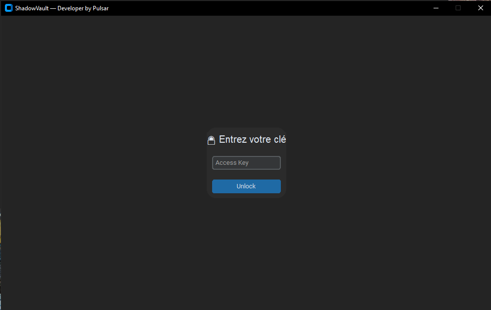
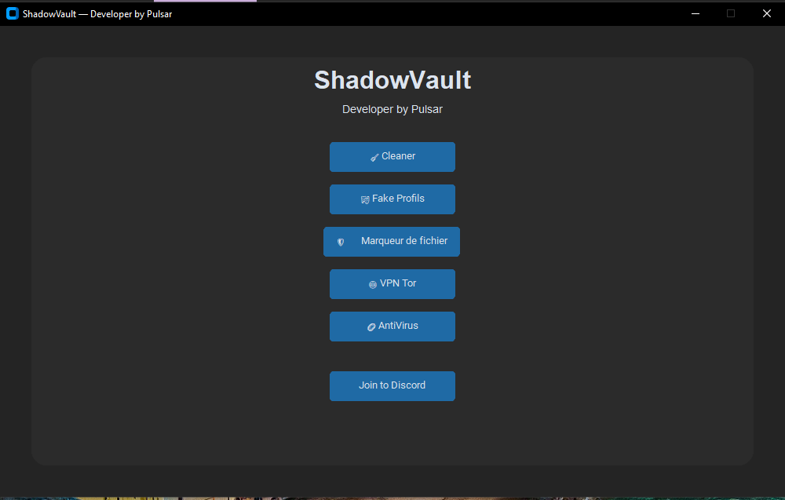
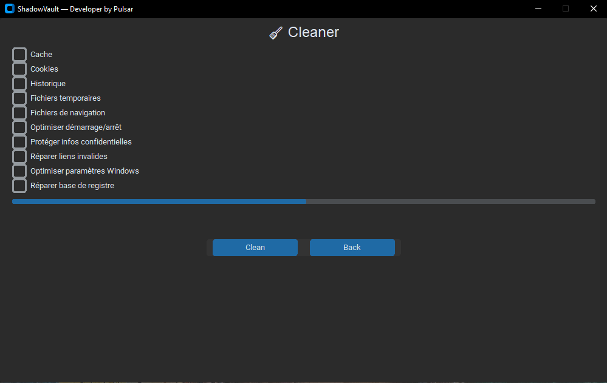

# 🔐 ShadowVault — Protection & Anonymat PC

**ShadowVault** est un logiciel tout-en-un de sécurité pour Windows, développé en Python.  
Il est conçu pour vous aider à rester **anonyme**, **protéger vos fichiers**, **nettoyer vos traces** numériques, et plus encore.

⚠️ Version actuelle : **Bêta 1.0**  
👤 Développeur : Pulsar

## 🛡️ Fonctionnalités principales

- 🔍 **Antivirus intégré** : analysez n’importe quel fichier.
- 🧹 **Nettoyeur** : supprime les caches, cookies, historique, fichiers temporaires, etc.
- 👤 **Fake profils** *(en phase de test)*.
- 🔒 **Cryptage de fichiers**.
- 🛡️ **VPN Tor** *(à venir)*.
- 🗂️ **Marqueur de fichiers sensibles**.
- 💬 Lien direct vers le **support Discord** pour vos questions.

## 🖥️ Aperçu de ShadowVault

### 🔐 Accès sécurisé

### 🧩 Menu principal

### 🧼 Module de nettoyage

> 📁 Placez les images dans un dossier `/img` dans votre dépôt pour que les liens fonctionnent sur GitHub.

## 🚀 Installation

Aucune installation requise :

1. Téléchargez le fichier **`ShadowVault.exe`**
2. Double-cliquez simplement pour le lancer
3. Profitez des fonctionnalités

✅ Le logiciel est **garanti sans virus**  
Vous pouvez le vérifier vous-même ici :  
👉 [Vérification VirusTotal](https://www.virustotal.com/gui/home/upload)

-

## 📩 Support & Contact

Rejoignez la communauté et posez vos questions ici :  
👉 [Serveur Discord officiel](https://discord.gg/ushtVjcys6)

## 📌 À savoir

- Le projet est actuellement en **Bêta** : certaines fonctionnalités peuvent être instables.
- Vos retours sont précieux pour améliorer ShadowVault !  
Merci 🙏
